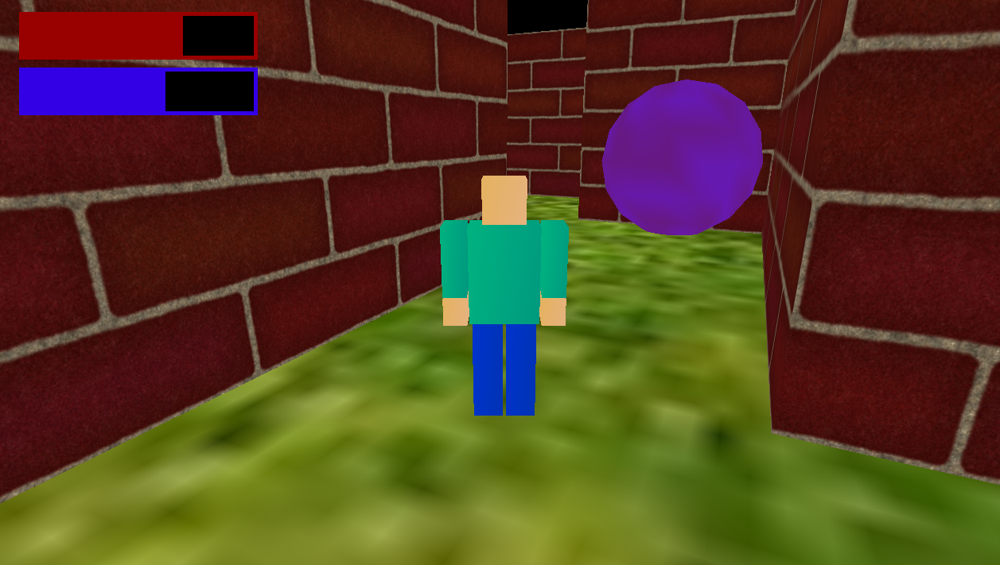

## Survival Maze ##

Survival Maze is a project developed for the Computer Graphics subject. The player must find his way out of the procedurally generated maze and deal with the pressure of time and enemies in order to win the game.

## Preview ##

## Homework reference ##
https://ocw.cs.pub.ro/courses/egc/teme/2021/02

## Tech stack ##
 * C++
 * OpenGL 3D
 * [Computer Graphics UPB Framework](https://github.com/UPB-Graphics/gfx-framework)

## Features ##

 * Procedurally generated maze with [Hunt And Kill algorithm](https://github.com/john-science/mazelib/blob/master/docs/MAZE_GEN_ALGOS.md#:~:text=the%20final%20maze.-,Hunt%2Dand%2DKill,-Click%20to%20see)
 * First/Third-person camera
 * Projectiles
 * Randomly spawned moving enemies
 * Collisions 
 * Animations and graphic design
 * HP and time HUD

## Gameplay ##
https://www.youtube.com/watch?v=lv1evI9bT-k
